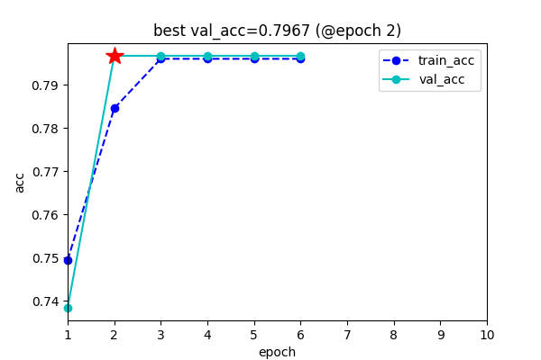

# SuperECG

## Project Structure

```
./
├── CardiacArrhythmia/ -> <DataPath>
├── README.md
├── bmedesign-ecg/ -> <DataPath>
├── cache/
├── checkpoint
├── data_explain.md
├── dataset.py
├── history.png
├── image.png
├── metric.py
├── requirements.txt
├── train.py
├── train_with_keras.py
├── utils.py
└── 可识别未知类型心电数据的AI算法.pdf
```

## Train
